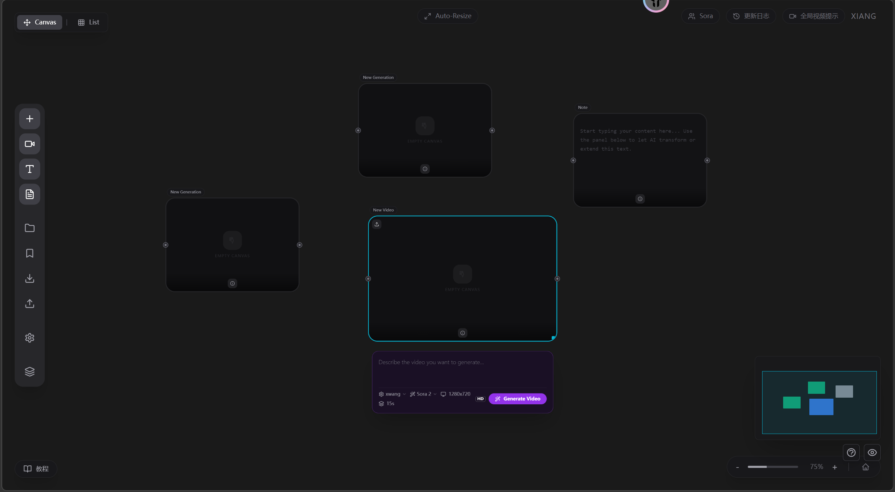

# X-tapnow

Node-based AI creation workspace with an infinite canvas for image, video, and text workflows.

[English](./README.en.md) | [Simplified Chinese](./README.zh-CN.md)

## Table of Contents

- [Preview](#preview)
- [Features](#features)
- [Tech Stack](#tech-stack)
- [Getting Started](#getting-started)
- [Configuration](#configuration)
- [Scripts](#scripts)
- [Docker](#docker)
- [Project Docs](#project-docs)
- [License](#license)

## Preview



## Features

- Infinite canvas with node/group workflow editing
- Multi-provider support for image, video, and text generation
- Local persistence (IndexedDB + localStorage)
- JSON import/export for workflows

## Tech Stack

- React + TypeScript + Vite
- Tailwind CSS
- idb-keyval (IndexedDB persistence)

## Getting Started

### Prerequisites

- Node.js 18+ (recommended)
- npm 9+

### Install

```bash
npm install
```

### Run (Development)

```bash
npm run dev
```

### Build (Production)

```bash
npm run build
```

## Configuration

- No required environment variable for startup
- API keys can be configured directly in the frontend Settings page
- Optional env template: [`.env.example`](./.env.example)

## Scripts

- `npm run dev`: start local dev server
- `npm run build`: build production bundle
- `npm run preview`: preview production build

## Docker

```bash
docker compose up --build
```

## Project Docs

- English full docs: [README.en.md](./README.en.md)
- Chinese full docs: [README.zh-CN.md](./README.zh-CN.md)
- Contributing guide: [CONTRIBUTING.md](./CONTRIBUTING.md)
- Security policy: [SECURITY.md](./SECURITY.md)
- Code of Conduct: [CODE_OF_CONDUCT.md](./CODE_OF_CONDUCT.md)

## License

This project is licensed under the MIT License. See [LICENSE](./LICENSE).
